# ReengKigo 관리자 서버 시스템 플로우 문서

## 1. 시스템 전체 플로우

### 1.1 서버 시작 프로세스

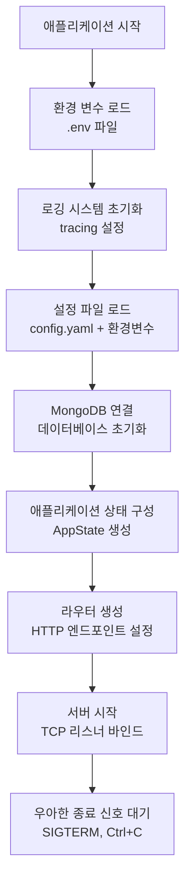

**주요 구성 요소:**
- **설정 우선순위**: 기본값 → config.yaml → 환경변수 (APP_ 접두사)
- **데이터베이스**: MongoDB 비동기 연결
- **관찰성**: tracing을 통한 구조화된 로깅
- **우아한 종료**: 진행 중인 요청 완료 후 종료

### 1.2 요청 처리 플로우

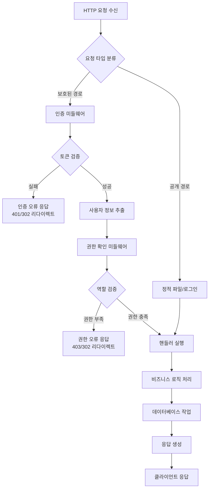

## 2. 인증 및 권한 관리 플로우

### 2.1 사용자 로그인 플로우

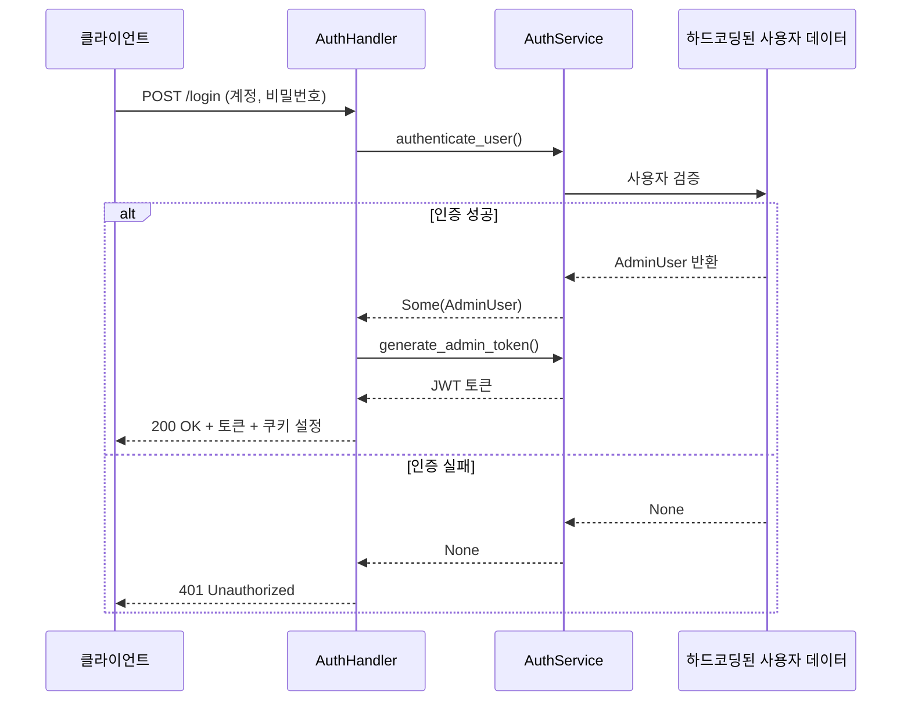

**인증 처리 세부사항:**
- 사용자 자격증명은 현재 하드코딩됨 (추후 데이터베이스 연동 예정)
- JWT 토큰에는 username, role, exp 정보 포함
- 두 개의 쿠키 설정:
  - `auth_token`: HttpOnly 쿠키 (실제 인증용)
  - `auth_status`: JavaScript 접근 가능 (상태 확인용)

### 2.2 권한 검증 플로우

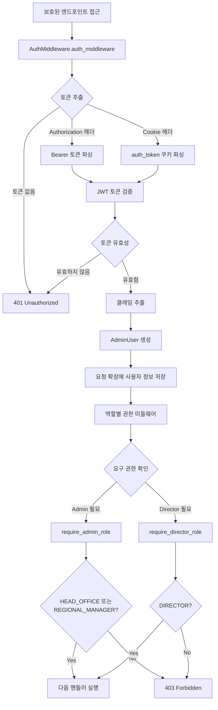

**역할별 권한:**
- **HEAD_OFFICE**: 최고 관리자 (모든 기능 접근)
- **REGIONAL_MANAGER**: 지역 관리자 (관리자 기능 접근)
- **DIRECTOR**: 감독관 (감독관 기능만 접근)

## 3. 자산 관리 플로우

### 3.1 자산 생성 플로우

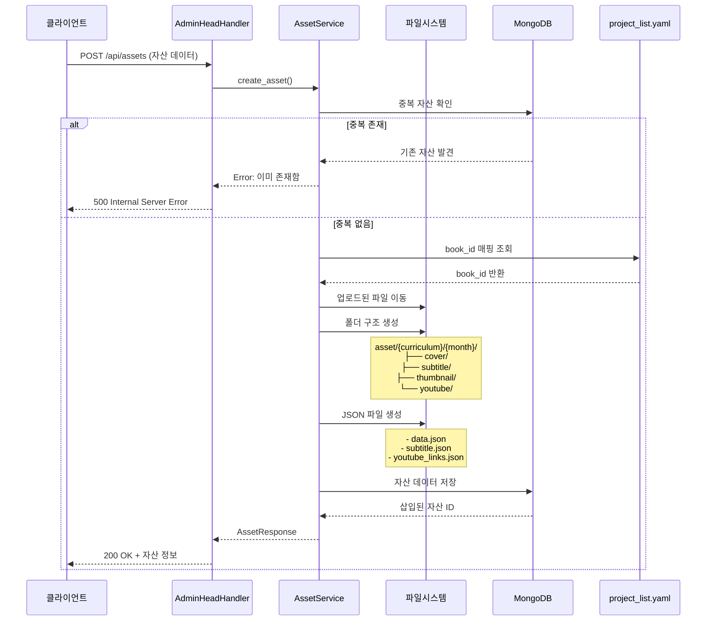

**파일 시스템 구조:**
```
asset/
├── {curriculum}/
│   └── {month}/
│       ├── cover/           # 표지 이미지
│       ├── subtitle/        # 자막 텍스트 파일
│       ├── thumbnail/       # 썸네일 이미지
│       ├── youtube/         # 유튜브 관련 파일
│       ├── data.json        # 자산 메타데이터
│       └── subtitle.json    # 자막 데이터
```

### 3.2 파일 업로드 플로우

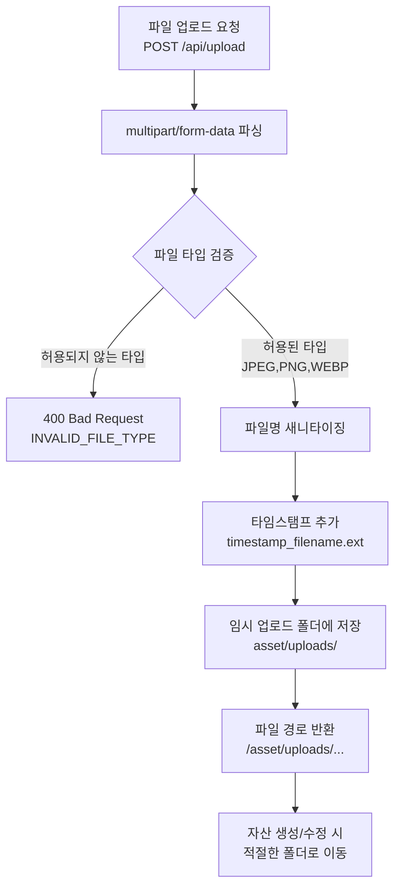

**보안 고려사항:**
- 허용된 MIME 타입: `image/jpeg`, `image/jpg`, `image/png`, `image/webp`
- 파일명 새니타이징: 영숫자, 점, 언더스코어, 하이픈만 허용
- 타임스탬프 추가로 파일명 충돌 방지

### 3.3 자산 수정 플로우

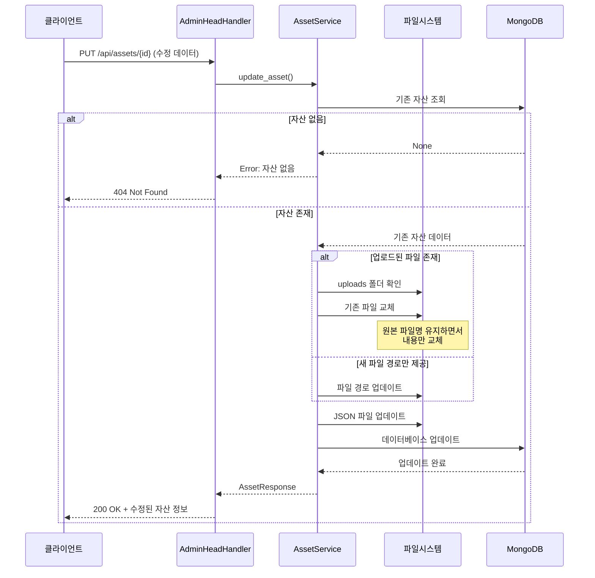

### 3.4 자산 삭제 플로우

```mermaid
flowchart TD
    A[자산 삭제 요청<br/>DELETE /api/assets/{id}] --> B[자산 ID 검증]
    B --> C[데이터베이스에서 자산 조회]
    
    C --> D{자산 존재?}
    D -->|No| E[404 Not Found]
    D -->|Yes| F[데이터베이스에서 삭제]
    
    F --> G[자산 폴더 경로 확인<br/>asset/{curriculum}/{month}]
    G --> H[전체 폴더 삭제]
    H --> I{파일 시스템 삭제 성공?}
    
    I -->|실패| J[경고 로그 기록<br/>데이터베이스는 이미 삭제됨]
    I -->|성공| K[성공 로그 기록]
    
    J --> L[204 No Content]
    K --> L
```

## 4. 데이터베이스 연동 플로우

### 4.1 MongoDB 연결 관리

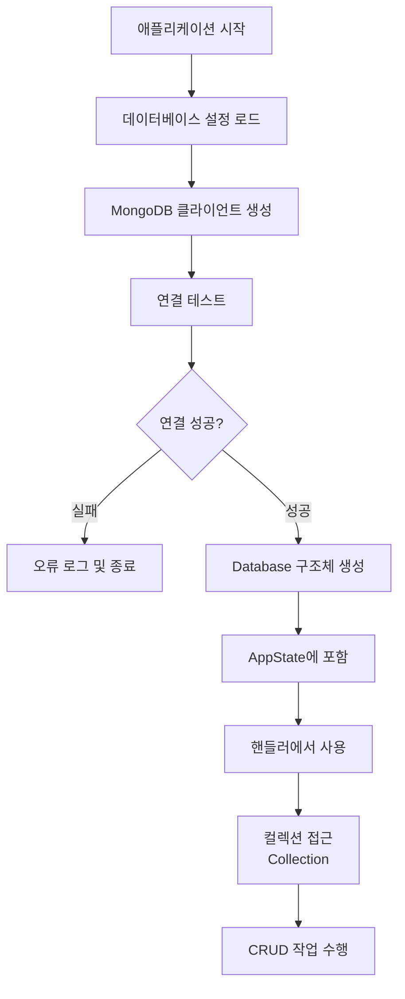

**MongoDB 작업 패턴:**
```rust
// 컬렉션 접근
let collection: Collection<Asset> = db.database.collection("assets");

// 조회
let filter = doc! {"curriculum": "jelly"};
let cursor = collection.find(filter, None).await?;

// 삽입
let result = collection.insert_one(&asset, None).await?;

// 업데이트
let update = doc! {"$set": bson::to_bson(&asset)?};
collection.update_one(filter, update, None).await?;

// 삭제
collection.delete_one(filter, None).await?;
```

### 4.2 데이터 변환 플로우

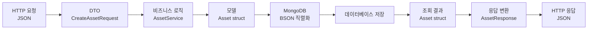

**데이터 계층 구조:**
- **DTO (Data Transfer Object)**: API 요청/응답 형식
- **Model**: 비즈니스 로직과 데이터베이스 구조
- **BSON**: MongoDB 직렬화 형식

## 5. 파일 시스템 관리 플로우

### 5.1 폴더 구조 생성

```mermaid
flowchart TD
    A[자산 생성 요청] --> B[Asset 모델 생성]
    B --> C[폴더 경로 계산<br/>asset/{curriculum}/{month}]
    
    C --> D[하위 폴더 생성]
    D --> E[cover/ 폴더]
    D --> F[subtitle/ 폴더]
    D --> G[thumbnail/ 폴더]
    D --> H[youtube/ 폴더]
    
    E --> I[파일 이동 및 저장]
    F --> I
    G --> I
    H --> I
    
    I --> J[메타데이터 파일 생성<br/>data.json, subtitle.json]
```

### 5.2 파일 이동 및 관리

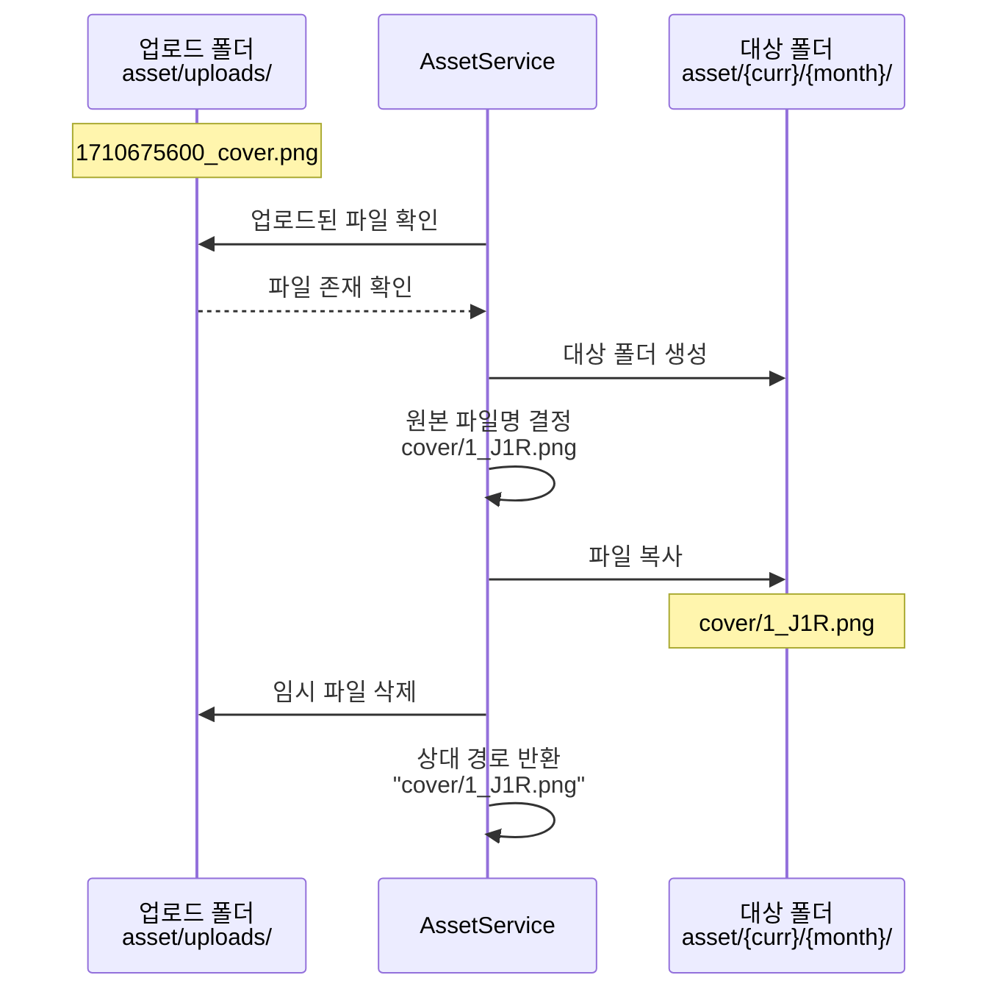

**파일 이동 규칙:**
1. 업로드 시: `asset/uploads/timestamp_filename`
2. 이동 시: `asset/{curriculum}/{month}/{type}/filename`
3. 데이터베이스 저장: `{type}/filename` (상대 경로)

## 6. 오류 처리 및 로깅 플로우

### 6.1 오류 처리 계층

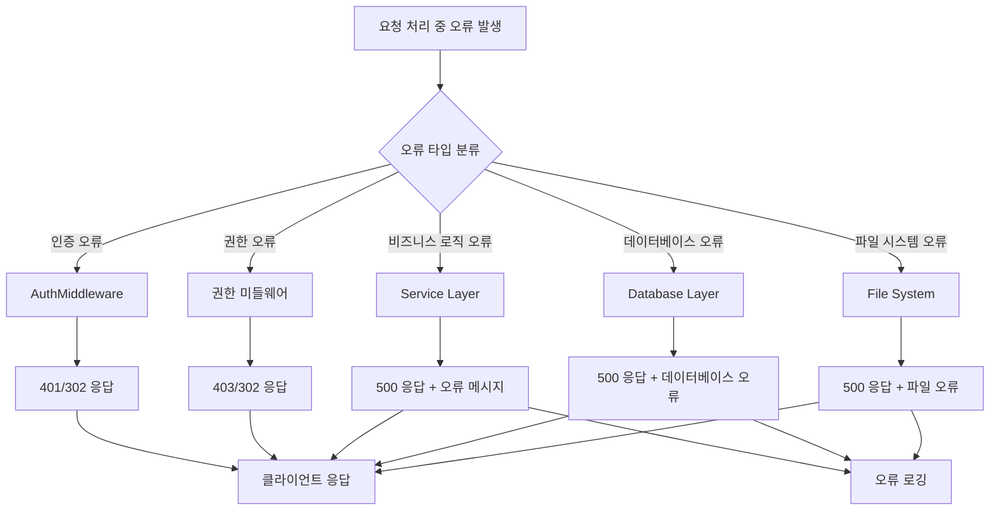

### 6.2 로깅 플로우

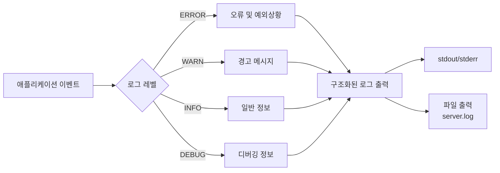

**주요 로깅 포인트:**
- 사용자 인증 시도 및 결과
- 자산 CRUD 작업
- 파일 업로드/이동/삭제
- 데이터베이스 연결 및 쿼리
- 서버 시작/종료
- 오류 및 예외 상황

## 7. 설정 관리 플로우

### 7.1 계층적 설정 로딩

```mermaid
flowchart TD
    A[설정 로딩 시작] --> B[기본값 설정<br/>AppConfig::default()]
    B --> C[config.yaml 파일 로드]
    C --> D{파일 존재?}
    
    D -->|Yes| E[YAML 파싱 및 병합]
    D -->|No| F[기본값 유지]
    
    E --> G[환경변수 로드<br/>APP_ 접두사]
    F --> G
    
    G --> H[환경변수 파싱 및 병합]
    H --> I[최종 설정 구성체 생성]
    I --> J[설정 검증]
    
    J --> K{설정 유효?}
    K -->|Yes| L[AppConfig 반환]
    K -->|No| M[오류 반환 및 종료]
```

**설정 우선순위 (높은 순):**
1. 환경변수 (`APP_DATABASE_URL`, `APP_SERVER_PORT` 등)
2. config.yaml 파일
3. 코드 내 기본값

**예시 설정 오버라이드:**
```yaml
# config.yaml
server:
  port: 8080
```

```bash
# 환경변수 (최고 우선순위)
export APP_SERVER_PORT=3000
export APP_DATABASE_URL=mongodb://localhost:27017
```

## 8. 보안 플로우

### 8.1 JWT 토큰 생명주기

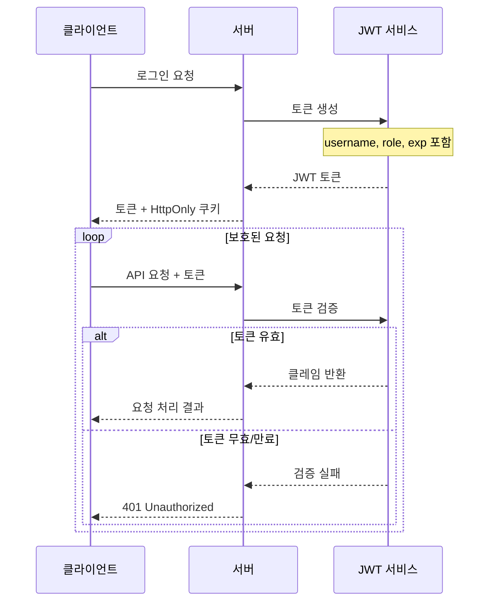

### 8.2 파일 업로드 보안

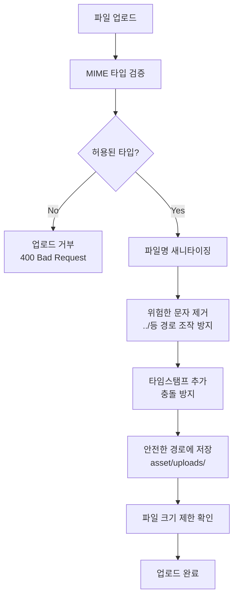

**보안 조치:**
- MIME 타입 화이트리스트
- 파일명 새니타이징
- 경로 탐색 공격 방지
- 업로드 폴더 격리
- 파일 크기 제한 (multipart 설정)

이 시스템 플로우 문서는 ReengKigo 관리자 서버의 모든 주요 프로세스와 데이터 흐름을 설명합니다. 각 플로우의 세부 구현은 해당 소스 코드 모듈을 참조하시기 바랍니다.